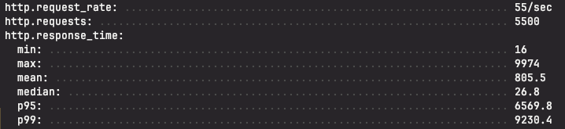

# learn-be-performance

- 백엔드 성능 개선

### setting server
    
```bash

# database
scp .\shortenurlservice-0.0.1-SNAPSHOT.jar root@{ip주소}:/root/

sudo dnf update
sudo dnf install dnf-plugins-core
sudo dnf config-manager --add-repo https://download.docker.com/linux/centos/docker-ce.repo
sudo dnf install docker-ce docker-ce-cli containerd.io
sudo systemctl start docker
sudo systemctl enable docker

# application
docker run --name mysql-container -e MYSQL_ROOT_PASSWORD=somepassword -e MYSQL_DATABASE=shortenurl -p 3306:3306 -v /root/mysql-data:/var/lib/mysql -d mysql:latest

# jdk update 17
sudo dnf update
sudo dnf install java-17-openjdk-devel
sudo update-alternatives --config java

# 8080 방화벽 열기
sudo dnf update
sudo dnf install java-17-openjdk-devel
sudo update-alternatives --config java

# nohup (Background)
nohup java -jar shortenurlservice-0.0.1-SNAPSHOT.jar > shortenurlservice.log 2>&1 &
```

### install artillery
```bash
$ npm install -g artillery@latest
```

### run mysql
```bash
$ docker run --name mysql-container -e MYSQL_ROOT_PASSWORD=somepassword -e MYSQL_DATABASE=shortenurl -p 3306:3306 -d mysql:latest
```

### test artillery
```bash
# 테스트 스크립트 실행 및 결과 저장
artillery run create-load-test.yaml -o create-load-report.json

# HTML 보고서 생성
artillery report --output create-load-report.html create-load-report.json
```

### 튜닝 비교

#### POST

- default

- connection pool 1

- key generator (snowflake)

#### GET
- default


- add index

- concurrent hash map

- redis

